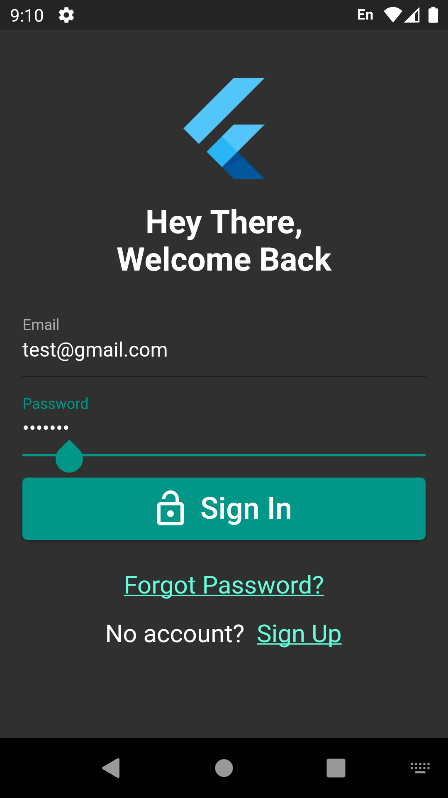
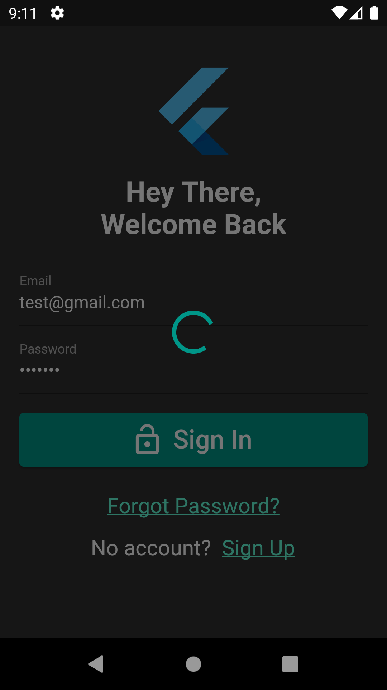
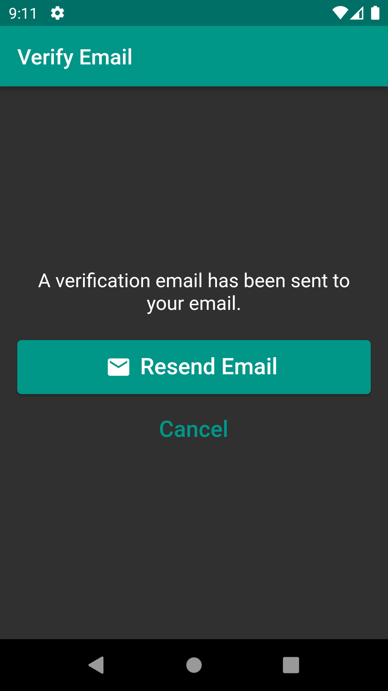
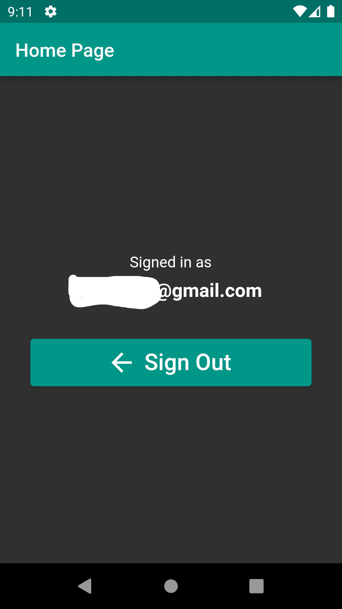
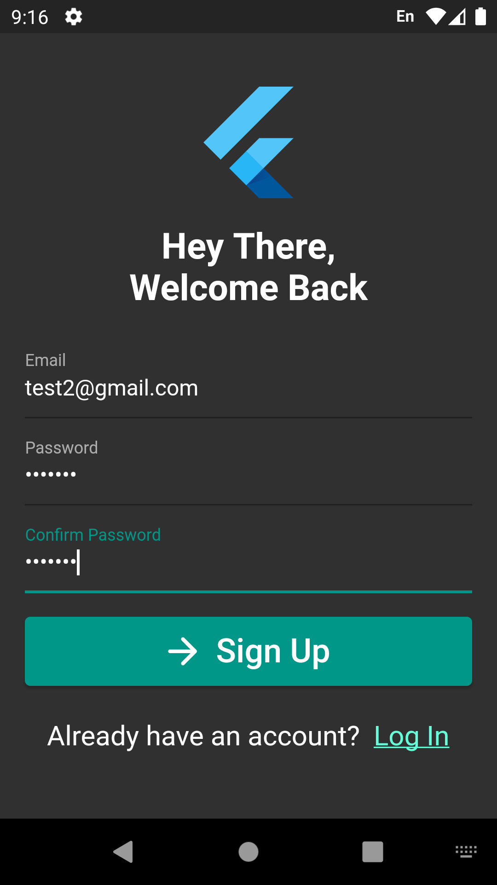
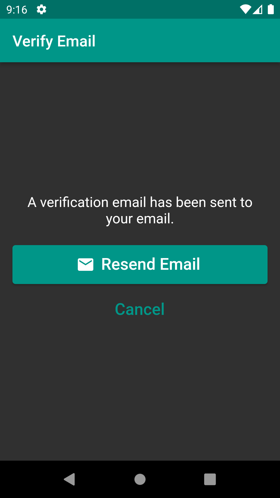
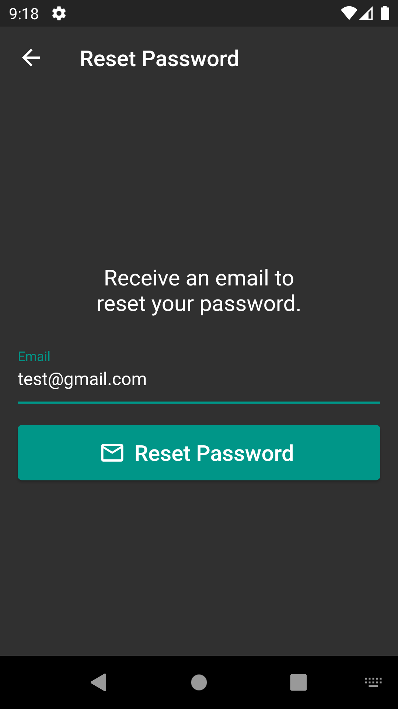
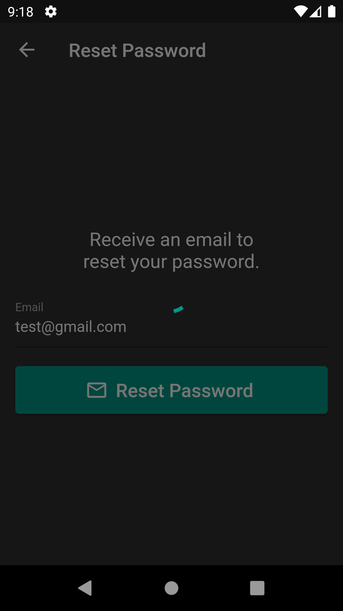
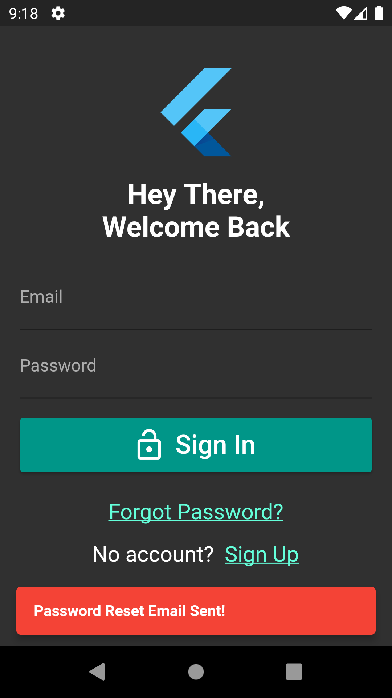

# myfirebase_app2

A flutter app to demonstrate usage of Firebase Aauthentication to Sign in user via email and password using firebase auth.

# Screenshots
### Sign In

    

### Sign Up

  

### Forgot Password

   

